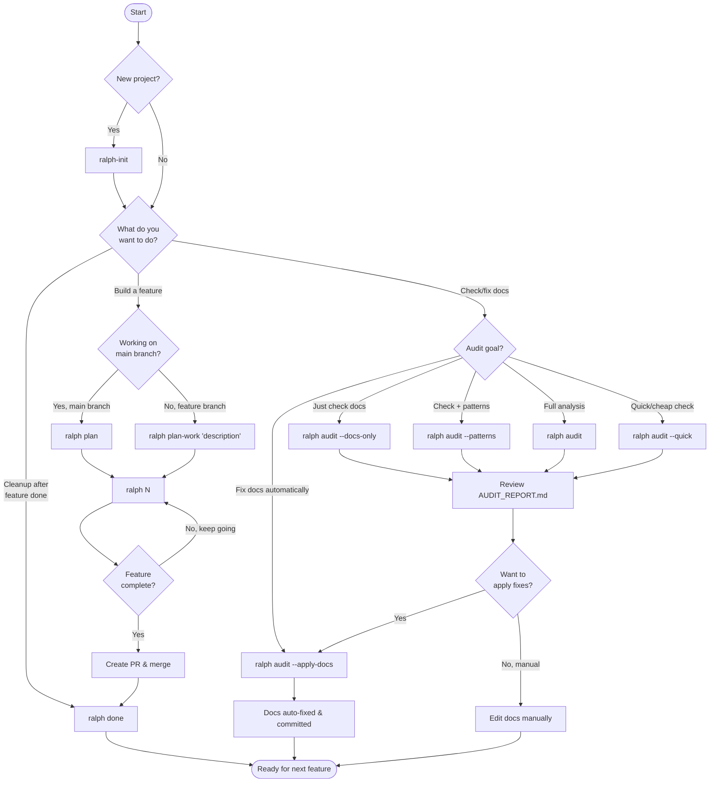

# Ralph v2 - Command Flowchart

## When to Use Which Command



---

## Quick Reference Decision Tree

```
START HERE
    │
    ├── Is this a new project?
    │   └── YES → ralph-init
    │
    ├── Do you want to BUILD something?
    │   │
    │   ├── Working on main/master branch?
    │   │   └── ralph plan → ralph 20
    │   │
    │   └── Working on a feature branch?
    │       └── ralph plan-work "description" → ralph 20
    │
    ├── Do you want to CHECK/FIX documentation?
    │   │
    │   ├── Just verify accuracy (cheap)
    │   │   └── ralph audit --docs-only --quick
    │   │
    │   ├── Full analysis with patterns
    │   │   └── ralph audit --full
    │   │
    │   └── Auto-fix documentation issues
    │       └── ralph audit --apply-docs
    │
    └── Done with a feature?
        └── ralph done (archives working files)
```

---

## Scenario Examples

### Scenario 1: New Project Setup
```bash
cd my-new-project
git init
ralph-init                    # Creates AGENTS.md, specs/, etc.
# Edit AGENTS.md with your build/test commands
# Create specs/first-feature.md
ralph plan                    # Generate implementation plan
ralph 20                      # Build it
```

### Scenario 2: Adding a Feature (Solo Developer)
```bash
git checkout -b feat/dark-mode
ralph plan-work "dark mode toggle with system preference detection"
ralph 15                      # Build until done
# Create PR, get it reviewed, merge
git checkout main
ralph done                    # Archive working files
```

### Scenario 3: Multiple People Using Ralph
```bash
# Alice works on auth
git checkout -b alice/user-auth
ralph plan-work "user authentication with OAuth"
ralph 10

# Bob works on dashboard (same time, no conflicts!)
git checkout -b bob/dashboard
ralph plan-work "analytics dashboard with charts"
ralph 10

# Each has their own local IMPLEMENTATION_PLAN.md
# No conflicts because working files are gitignored
```

### Scenario 4: Documentation Drift
```bash
# Ralph seems confused or going in circles
ralph audit --docs-only --quick   # Fast check: are docs accurate?

# Review AUDIT_REPORT.md, see what's wrong
cat AUDIT_REPORT.md

# Auto-fix the issues
ralph audit --apply-docs

# Or do a thorough audit with pattern analysis
ralph audit --full --apply
```

### Scenario 5: Onboarding / Code Review
```bash
# Before onboarding new team member, verify docs are good
ralph audit --full

# Share AUDIT_REPORT.md or fix issues first
ralph audit --apply-docs
```

### Scenario 6: Quick Health Check
```bash
# Cheap, fast audit (uses fewer API calls)
ralph audit --quick --docs-only

# Still generates AUDIT_REPORT.md but costs less
```

---

## Command Cheat Sheet

| Situation | Command |
|-----------|---------|
| New project | `ralph-init` |
| Plan work on main | `ralph plan` |
| Plan work on branch | `ralph plan-work "description"` |
| Build (20 iterations) | `ralph 20` |
| Build (unlimited) | `ralph` |
| Quick doc check | `ralph audit --docs-only --quick` |
| Full audit | `ralph audit` |
| Auto-fix docs | `ralph audit --apply-docs` |
| Feature complete | `ralph done` |
| Check prerequisites | `ralph-check` |

---

## File Lifecycle

```
                    COMMITTED (shared)              GITIGNORED (local)
                    ─────────────────              ──────────────────

ralph-init    →     AGENTS.md
                    specs/

ralph plan    →                                    IMPLEMENTATION_PLAN.md

ralph N       →     (code changes)                 IMPLEMENTATION_PLAN.md

ralph audit   →                                    AUDIT_REPORT.md

--apply-docs  →     AGENTS.md (fixed)
                    CLAUDE.md (fixed)

ralph done    →                                    → .ralph-v2/archive/
```

---

## Cost Guide

| Command | Relative Cost | Use When |
|---------|---------------|----------|
| `ralph audit --docs-only --quick` | $ | Quick sanity check |
| `ralph audit --docs-only` | $$ | Thorough doc verification |
| `ralph audit --patterns` | $$$ | Need pattern analysis |
| `ralph audit --full` | $$$$ | Complete analysis |
| `ralph plan` | $$$ | Starting new project phase |
| `ralph plan-work` | $$ | Scoped feature work |
| `ralph N` (per iteration) | $$ | Building |
